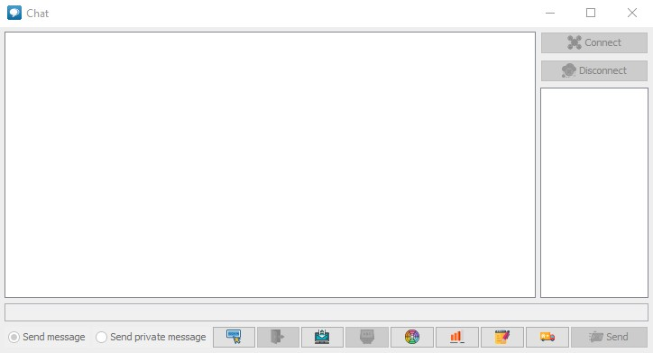

# Сетевой чат
- Участники: Ищенко Тимофей Сергеевич, Белякова Анастасия Александровна, Зайцева Ангелина Сергеевна, Соцкова Ксения Андреевна, Леванкова Анастасия Сергеевна, Земячковский Дмитрий Александрович.
- Группа: 2ИСП11-18

### Технические характеристики
- IDE: IntelliJ IDEA
- Управление проектом: Maven
- Управление версиями: github

## Функциональность

#### Регистрация
- Пользователь может зарегистрироваться, но если есть пользователь с таким именем, регистрация не удастся.
- Для регистрации необходимо заполнить имя пользователя по форме: имя пользователя начинается с заглавной буквы, обязательна хотябы одна цифра. 

#### Авторизация
- Войдите, используя свое имя пользователя и пароль. После входа в систему вы сможете войти на сервер.

#### Личные сообщение
- Вы также можете отправить личное сообщение пользователю, а также получить личное сообщение от пользователя.

#### Логи
- На стороне сервера сервер может отслеживать всю информацию.

#### Запуск/Остановка сервера
- В окне сервера сервер можете запустить или закрыть сервер вручную.

#### База данных
- Все пользовательские данные хранятся в базе данных.
- Все сообщения пользователей будут записываться в базу данных, в том числе личные.

___

- Вы можете изменить цвет сообщения.
- Вы можете отключить уведомления.
- Вы можете сохранить сообщение журнала.
- Вы можете изменить свое имя в чате, и все пользователи увидят, что вы изменили свое имя.

___

- Графическая часть реализована с использованием Swing.
- Данные учетной записи и история чата хранятся на стороне сервера с помощью SQLite.
- Работа с базой данных основана на JDBC.
- В проекте используются зависимости от репозитория Maven.

---

# Начало работы
- Включаем сервер 
## Чат
- 

---

## Сервер
- 

---

# Начало работы
- Запускаем серверное приложение
- Нажимаем на кнопку "Запустить сервер"
- В открывшемся окне прописываем "9933"
- Запускаем клиентское приложение
- Нажимаем на кнопку "Регистрация пользователя"
- Вводим имя пользователя по форме: Первая большая буква и хотябы одна цифра. И пароль.
- Нажимаем кнопку "подключение"
- Вводим ip-адрес нашего устройства, если мы хост
- Вводим порт "9933" 
